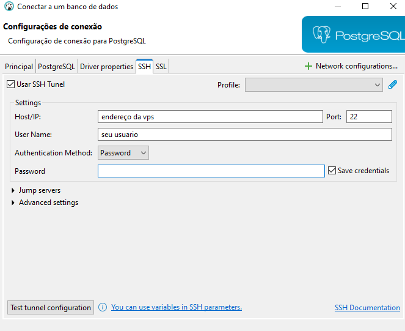

# Guia para Conectar ao Banco de Dados PostgreSQL

## 1. Baixar o Programa para Acessar o Banco de Dados
Para acessar o PostgreSQL, usaremos o programa **DBeaver**.

🔗 [Baixar DBeaver](https://dbeaver.io/download/)

## 2. Criar uma Conexão com o PostgreSQL
1. Abra o **DBeaver**.
2. Clique em **Nova Conexão**.
3. Escolha a opção **PostgreSQL**.

### 3. Preencher os Dados de Conexão
- **Host**: IP da sua VPS
- **Porta**: `5432`
- **Banco de Dados**: `postgres`
- **Usuário**: `whazing`
- **Senha**: `AKwWM4Qu2GRppJ7`

## 4. Exibir Todos os Bancos de Dados
Para visualizar todos os bancos disponíveis, ative a opção correspondente dentro do **DBeaver**.

## 5. Configurar Acesso via SSH (se necessário)
Se precisar acessar o banco de dados remotamente:
1. Vá até a aba **SSH**.
2. Marque a opção **Usar túnel SSH**.
3. Preencha os dados da sua VPS.

### Exemplos Visuais:
🖼️ **Configuração do Banco de Dados**
> 

🖼️ **Configuração SSH**
> 

Agora você está pronto para acessar e gerenciar seu banco de dados PostgreSQL! 🚀