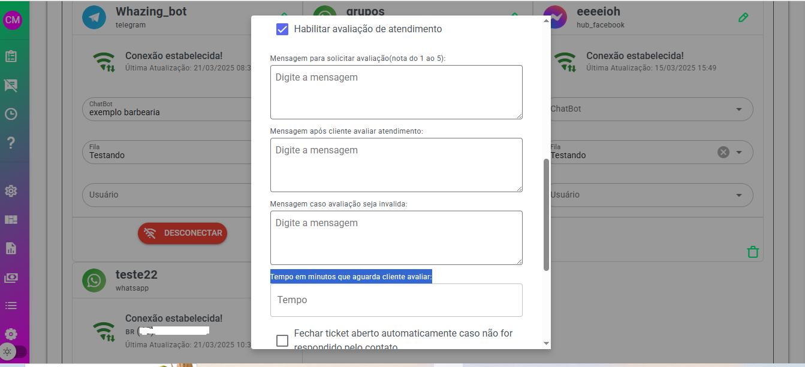
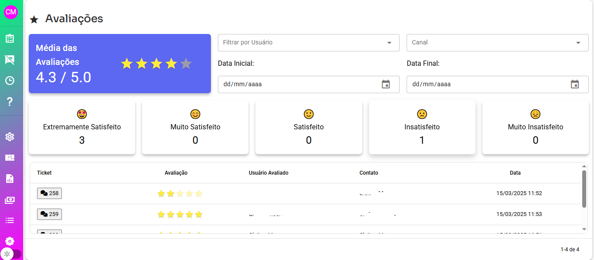

# **Como Configurar a Avaliação de Atendimento**

## **Passos para Configuração**

1. Acesse **Canais** na plataforma.
2. Clique no ícone de lápis para **editar** o canal desejado.
3. Localize a opção **Habilitar Avaliação de Atendimento** e ative-a.

## **Campos para Configuração**
Ao habilitar a avaliação de atendimento, você poderá configurar os seguintes campos:

### **1. Mensagem para Solicitar Avaliação**
- Aqui, você define a mensagem que será enviada ao cliente para solicitar uma avaliação do atendimento. 
- **Exemplo de mensagem:** "Por favor, avalie nosso atendimento com uma nota de 1 a 5. Sua opinião é muito importante para nós!"

### **2. Mensagem Após o Cliente Avaliar**
- Defina o texto que será enviado após o cliente realizar a avaliação.
- **Exemplo de mensagem:** "Obrigado por compartilhar sua opinião! Estamos sempre buscando melhorar."

### **3. Mensagem para Avaliação Inválida**
- Configure o texto caso o cliente envie uma avaliação fora do formato esperado (por exemplo, uma nota que não esteja entre 1 e 5).
- **Exemplo de mensagem:** "Sua avaliação não foi válida. Por favor, envie uma nota entre 1 e 5."

### **4. Tempo para Avaliação**
- Determine o tempo, em minutos, que o sistema aguardará para receber a avaliação do cliente após o envio da solicitação.
- **Exemplo:** Defina 10 minutos, caso queira que o cliente tenha esse intervalo para responder.

## **Monitoramento do Desempenho**
- Para acompanhar os resultados, acesse os **Relatórios** na plataforma.
- Os relatórios exibem informações detalhadas sobre o desempenho da equipe, como:
  - Quantidade de avaliações recebidas.
  - Média das notas atribuídas.
  - Percentual de avaliações válidas/inválidas.

---

**Exemplo de Uso:**
Após habilitar e configurar o canal, o fluxo no finalizar atendimento será assim:
1. O cliente recebe: "Por favor, avalie nosso atendimento com uma nota de 1 a 5."
2. Envia uma nota. Exemplo: **5.**
3. Caso válido, recebe: "Obrigado por compartilhar sua opinião!"
4. A equipe pode visualizar a avaliação nos relatórios para analisar desempenho.

